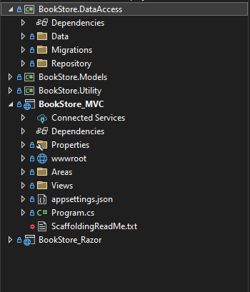

# Book Store

A full-stack **ASP.NET Core 8.0 MVC** application with **Razor Pages, .NET Identity, and MS SQL Server 2022** for managing books, users, and orders. This project follows **N-Tier Architecture** and the **Repository Pattern** to ensure scalability and maintainability.

## Features

- **Book Management** - Create, update, delete, and view books.
- **User Authentication & Role-Based Access** - Implemented using **.NET Identity**.
- **Image Uploads** - Securely upload and manage book images.
- **Security Features** - Implemented **server-side & client-side validation**.
- **Real-time Notifications** - Integrated **Toastr notifications** for enhanced user experience.
- **N-Tier Architecture** - Separation of concerns between **Admin, Customer, and Core Logic**.
- **Entity Framework Core with MS SQL Server** - Database operations managed via **EF Migrations**.
- **Dependency Injection & Optimized Routing** - Ensuring efficiency and maintainability.

## Tech Stack

- **Backend**: ASP.NET Core 8.0, Entity Framework Core
- **Frontend**: Razor Pages, Bootstrap
- **Database**: MS SQL Server 2022
- **Authentication**: ASP.NET Core Identity
- **Notifications**: Toastr.js
- **Validation**: Server-side (Data Annotations) & Client-side (JavaScript)

## Project Structure



## Setup & Installation

### Clone the Repository

```sh
git clone https://github.com/nishant-nez/BookStore_MVC.git
cd BookStore_MVC
```

### Configure Database Connection

Update `appsettings.json` with your **MS SQL Server** connection string:

```json
"ConnectionStrings": {
    "DefaultConnection": "Server=YOUR_SERVER;Database=BookStoreDB;Trusted_Connection=True;"
}
```

### Apply Migrations & Seed Data

Run the following commands in the terminal:

```sh
dotnet ef database update
```

### Run the Application

```sh
dotnet run
```

The application will be available at `http://localhost:5000`.
